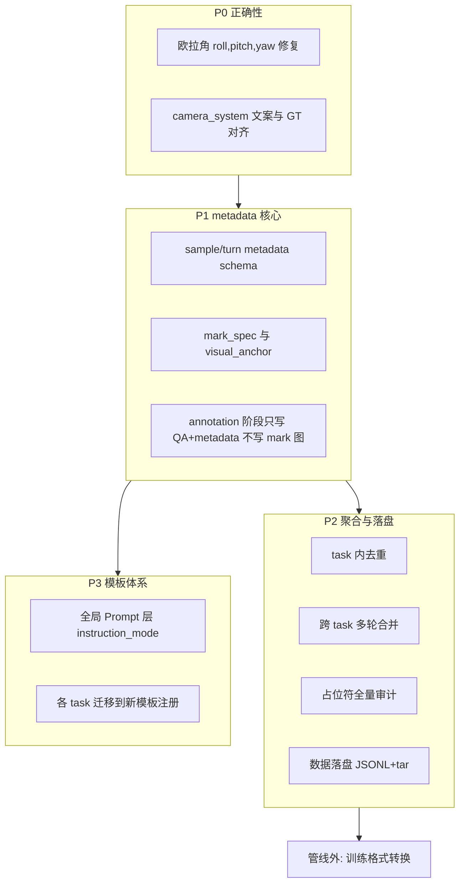
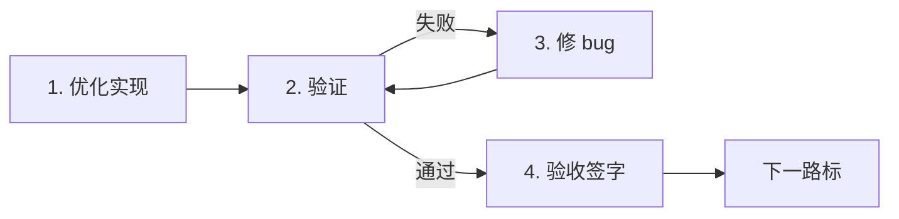
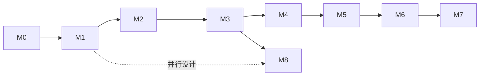

# OpenSpatial 标注管线数据集优化方案

> **状态**：方案设计 **v1.8**（与代码对齐；路标进度见 `verification/dataset_pipeline/MILESTONE_STATUS.md`）  
> **范围**：`annotation_stage`（各 task 写 parquet）→ **`aggregate_stage`**（去重 + 合并）→ `export_stage`（规划）  
> **设计主轴**：**sample 级 metadata**；**去重**（task 内，`aggregate`）与 **合并**（按预期渲染图像组，`aggregate`）为两件独立事  
> **关联代码**：`task/annotation/core/*`、`task/aggregate/*`、`dataset/image_base.py`、`verification/dataset_pipeline/validate_metadata.py`  
> **Schema 详表**：`assets/dataset_metadata_schema.md` · **prompt_struct**：`assets/prompt_struct_schema.md`

---

## 1. 背景与现状摘要

### 1.1 主流程

```
run.py
  └─ get_pipeline(config) → BasePipeline
       └─ 按 YAML stages 顺序执行 task
            └─ annotation_stage: *Generator.run(dataset)
                 └─ apply_transform: SceneGraph → process() → create_messages → 写 parquet
```

单帧标注的典型配置见 `config/annotation/demo_singleview_all.yaml`：多个 annotation task **并行依赖同一预处理 parquet**（`depends_on` 指向输入，而非链式依赖上一 task 输出），各 task 独立产出 `annotation_stage/<task>/data.parquet`。

### 1.2 单条样本的形态（目标态 · 已实现主体）

| 阶段 | 行为 |
|------|------|
| `process()` | 对每条输入行生成 `prompts[]`、`question_tags[]`、`question_types[]`；`emit_marked_images: false` 时 `QA_images` = **原图** |
| `_record_turn()` | 写入 `metadata.turns[]`（`prompt_struct`、`mark_spec` 含 **`mask_ref.path`**、`referent_mode` 等） |
| `create_messages_from_prompts()` | legacy 指称文本（含 `tag-(color mark)`）进入 `messages` |
| `flatten_annotations()` | **1 QA = 1 行**；每行 `metadata` 仅含 **当前** 该条 turn（非整 sample 全量 turns） |
| `save_data()` | `annotation_stage/<task>/data.parquet` |

**`aggregate_stage`（另跑 config）**：读各 task parquet → task 内 dedup → 按 `merge_group_key` 合并 → `aggregate_stage/merged_samples/data.parquet`（见 §4.2.3、§4.7.4）。

### 1.3 与目标态的差距（一句话）

**M1–M6 L1 代码已落地**（含 `PlaceholderAuditPass`，§4.5）；**L2 E2E**（frame_rot 重跑 + annotation audit + aggregate + placeholder audit）与 **M7**（JSONL+tar 导出）仍待完成。详见 `verification/dataset_pipeline/MILESTONE_STATUS.md`。

---

## 2. 问题诊断与根因

> 下列问题在方案中均收敛到：**先定义 metadata schema → 再实现依赖 metadata 的能力**。§2.4–2.6 为专项问题，实施顺序见 §4.0。

### 2.1 全部为单轮对话；缺少 task 内去重与跨 task 多轮合并

**现象**  
每条预处理输入可产出多个 QA，经 `flatten_annotations` 后变成多行；每行 `messages` 仅为 2 条（human + gpt）。各 annotation task 各自落盘，无法 **task 内** 去掉「同一核心问题、仅差模板/mark/选项顺序」的重复，也无法 **跨 task** 把「同图且 mark 渲染后一致」下的多条 QA 收成一条多轮 sample。

**两件独立事（定义，与实现对齐）**

| | **去重（dedup）** | **合并（merge）** |
|---|------------------|-------------------|
| **范围** | **同一 annotation task 内** | **不同 annotation task 之间** |
| **图像** | 同一张或同一组 `visual_anchor`（多视角时为 `view_group_id`） | 同一张或同一组；且 **`mark_spec` 归一化后一致**（预计在 `render_mark` 后像素一致） |
| **对象** | 参与提问的 **object 集合相同**（`obj_idx` 集合 + 角色一致，如 distance 的 A/B/C） | 不要求「问题相同」；各 task 产出不同 sub_task QA |
| **要消除/收纳的差异** | 仅 **表面差异**：有无/如何 mark、模板措辞、MCQ 选项顺序、答案表述变体等；**核心问题相同** | 无「重复」概念；把多条 **不同** QA 收成 **多轮 turns** |
| **结果** | 每组只 **保留 1 条** turn（可配置保留策略） | 一个 **sample** 下挂多个 turn（来自多个 `task_name`） |

**根因**

1. 无 **sample 级** 字段（`merge_group_key`、`turn_index` 等）。
2. 无 **task 内** `dedup_fingerprint`（核心问题指纹，**不含** mark_spec / 模板 id）。
3. `flatten_annotations` 强制 1 QA = 1 行，且丢弃跨 task 关联。
4. 若用同一 key 同时做去重与合并，会把「同图同对象、不同 mark」误当作合并组，或把「同图不同 task」误去重掉。

**与 metadata 的关系**

- **去重**：`visual_anchor` + `view_group_id` + `task_name` + **`question_core_key`**（由 `prompt_struct` / `objects_ref` / `sub_task` 派生，**显式排除** mark、模板变体、选项顺序，见 §4.2.1）。  
- **合并**：`merge_group_key` = `visual_anchor` + `view_group_id` + **规范化 `mark_spec`**（§4.2.2）；与 `task_name`、问题文本无关。

---

### 2.2 回答偏短；缺少与 task 解耦的指令—回答体系

**现象**  
大量答案仅为数值、单 token 或 MCQ 字母；问题侧偶有句式约束，但 **无统一的「指令模式」** 与 **成对的 Q/A 模板族**。

**根因**

1. 各 `*_prompt_templates.py` 独立维护，答案池含 `"[X]"` 等极短模板且均匀采样。
2. 未区分：**无指令约束** vs **带指令约束**（如“用一句话说明理由”“以 JSON 输出”）下的 Question 与 Answer 变体。
3. 指称与 mark 绑定：`[A]` 填入 `chair-(red box)` 等，无法无损切换「无图标注」文本（见 §4.3.2）。
4. 统计侧无 `instruction_mode`（或等价 tag），无法按模式聚合答案长度、遵从率。

**影响**  
难以系统性拉长回答或评估模型是否遵守格式指令；模板改动需逐个 task 修补。

**与 metadata 的关系**  
每条 QA turn 的 metadata 应记录：`instruction_mode`、`template_family`、`template_variant_id`、`answer_style`（short / constrained / verbose），供 §7 统计与门禁使用。

---

### 2.3 sample 级 metadata 缺失；mark 与图像耦合

**现象**  
产出 parquet 以 `messages`、`QA_images`（已 mark bytes）为主；预处理中的 `scene_id`、`id`、`obj_tags`、`bboxes_3d_world_coords` 等 **默认不落盘**。

**根因**

1. `keep_data_columns` 过窄。
2. `VisualMarker` 只输出图像，不输出可序列化的 **mark_spec**（含 mask 几何）。
3. `QA_images` 与 `image` 角色混淆，重刷需从文本反推对象。

**影响**  
无法 mark 回溯、无法按 metadata 重渲染、无法支撑去重合并与数据落盘导出。

**与 metadata 的关系**  
这是 **核心欠账**；§4.1 给出 schema，其它优化均依赖其落地。

---

### 2.4 占位符与模板占位符的全局一致性（非 tokenizer 映射问题）

**现象**  
部分样本中 **消息里的图像占位符个数** 与 **逻辑图像条数** 不一致；或占位符分散在 Question 中段而非约定位置。另存在 **模板占位符**（如 `[A]`、`[O]`、`[Y]`）未完全替换即进入 `messages` 的风险。

**说明（澄清）**  
此处 **不是** `<image>` 与 `<|image_pad|>` 的训练时映射问题，而是管线内 **各类占位符** 的生成与装配是否一致、是否遗漏。

**根因（待排查清单）**

| 类别 | 示例 | 风险点 |
|------|------|--------|
| 图像槽位 | `<image>`（`message_builder`）、Grounding 中 `sys + " <image> " + q` | 个数与 `n_views` / 图像列表长度不一致；位置不在 Question 约定区 |
| 模板填充 | `[A]` `[B]` `[X]` `[O]` `[Y]` `[T]` … | `PromptTemplate._fill` 遗漏；MCQ `[O]` 为空串时题干残留 |
| 多轮 | 仅首轮加 `<image>` | 与合并后 turn 结构冲突 |

**约束目标**  
当图像占位符个数与逻辑图像数不一致时：**将所有图像占位符移动到该条 Question 内容的最开头**（对 3D Grounding：`camera_system` 作为 Question prefix 紧随其后，见 §4.6）。  
**排查时机**：建议在 **数据落盘前** 做全量审计与修复（见 §4.5、§4.7）；若能在构建 `messages` 时保证不变式，可减少落盘前修补量。

---

### 2.5 3D Grounding：欧拉角顺序 bug（P0）

**现象**  
`camera_system` 文案中 bbox 角度顺序与代码/GT 不一致；属 **bugfix**，非风格问题。

| 来源 | 角度顺序 |
|------|----------|
| `scene_graph` / `box_3d_in_camera()` / `3d_grounding.py` 注释 | `roll, pitch, yaw`（**正确**） |
| `threed_grounding_prompt_templates.py` `camera_system_prompt` | 误写为 `pitch, yaw, roll` |

**任务形态**  
配置仅启用 `grounding_oe` **合理**——该类空间回归不适合 MCQ；方案 **不** 引入 `grounding_mcq`。

**结构约定（review 确认）**  
`camera_system` **不是** system role，**保持为 Question 的 prefix**（与现 `3d_grounding.create_messages_from_prompts` 一致）；修复时 **不得** 将其拆到 metadata 或单独 system 消息。

**与 metadata 的关系**  
`camera` 参数（fov、分辨率等）仍可 **冗余写入 metadata** 供统计与下游转换，但 **不改变** 其作为 Question prefix 出现在 `messages` 中的布局。

---

### 2.6 缺少规范的数据落盘形态

**现象**  
当前以 task 级 `data.parquet` 为终点，嵌套 bytes、多文件难关联，不便转换为多种下游训练格式。

**目标态**  
管线最终 **数据落盘** 采用 **`JSONL + 图像 tar`**：JSONL 每行一个 sample，含 **完整可追溯 metadata** 与合并后的对话。  
**注意**：该落盘格式 **不是**「训练交付」本身，而是 **训练交付的上位载体**——信息足够丰富，使 **管线外** 的转换脚本可生成 ShareGPT / LLaVA / 自定义 VLM 等格式（是否渲染 mark、mask 如何编码等决策放在转换层）。

---

### 2.7 已废弃：单目 `counting` task

**结论**：自 v1.8 起从单目 annotation / aggregate 配置与代码中移除；仓库内 **无** 多目 counting 实现，故不保留替代项。

**原逻辑（简述）**：对预处理 `obj_tags` 做字符串 `Counter`，仅对出现次数 > 1 的 tag 随机出题；GT = 该 tag 在列表中的条数。不用 mask / 点云 / 3D box，整图无实例标注。

**废弃原因（产线质量）**

| 问题 | 后果 |
|------|------|
| GT 为 **标签频次**，非画面可见实例数 | 重复检测、漏检、合并实例与「能看见几个」不一致 → **错题** |
| 题干偏视觉计数（如 “can you see”），监督来自 metadata 列表 | 问—答语义不对齐 |
| 无几何去重、无 mark 锚定 | 无法约束「数的是哪几个物体」 |

历史 parquet / `fingerprint` 对 `counting.*` 的处理可保留，仅用于合并旧数据；新跑批不再产出该 task。

---

## 3. 优化目标（metadata 为中心）

| 编号 | 目标 | 依赖 metadata |
|------|------|----------------|
| **G0** | 定义并落地 **sample / turn 级 metadata schema**（含 `mark_spec`、`instruction_mode`、溯源 ID） | —（基础） |
| **G1** | **task 内去重**（`dedup_fingerprint`）+ **跨 task 合并**（`merge_group_key`）；二者键不同 | `dedup_fingerprint`、`merge_group_key`、`turns[]` |
| **G2** | **与 anno task 解耦** 的 prompt 模板体系：无/有指令约束下的 Q&A 成对设计 | `instruction_mode`、`template_*` |
| **G3** | **mark 延迟渲染或不落盘 mark 图**；mask 标记可回溯（`mark_spec` 存几何或引用） | `mark_spec`、`visual_anchor` |
| **G4** | **占位符全管线审计** + 图像占位符前置归一化 | `placeholder_audit` 结果写入 metadata |
| **G5** | **P0**：欧拉角 `roll, pitch, yaw` bugfix；`camera_system` 保持 Question prefix | `bbox_frame` 约定字段 |
| **G6** | 产出 **数据落盘**（JSONL + tar），可转换为任意下游训练格式 | 行内嵌完整 metadata |

**优先级**  
`G5 (P0 bugfix)` → `G0` → `G1/G3/G4`（合并与落盘）→ `G2`（模板体系，可与 G0 并行设计）→ 下游转换（**管线外**）。

---

## 4. 分阶段优化方案

### 4.0 阶段划分总览

**§4 章节目录（按阅读顺序）**

| 节号 | 主题 | 路标 |
|------|------|------|
| [§4.1](#41-sample-级-metadata-schemag0--核心) | metadata / `mark_spec` schema | M1, M2, M3 |
| [§4.2](#42-去重task-内与合并按预期渲染图像组g1) | 去重 + 合并 + **`aggregate_stage` 流程** | M4, M5 |
| [§4.3](#43-mark-落盘与指称分离明确结论--可落地) | `render_mark`、`prompt_struct`、`mask_ref.path` | M2, M3 |
| [§4.4](#44-全局-prompt-模板体系g2与-anno-task-解耦) | `instruction_mode`、模板族 | M8 |
| [§4.5](#45-占位符全管线审计g4) | `PlaceholderAuditPass` | M6 |
| [§4.6](#46-3d-grounding-专项g5--p0-bugfix--约定巩固) | 欧拉角、`camera_system` prefix | M0 |
| [§4.7](#47-数据落盘jsonl--图像-targ6) | JSONL + tar 终态 | M7 |



- **P0**：仅 bugfix，可立即合入。  
- **P1**：阻塞去重合并与落盘；annotation task **改造为输出 metadata 优先**。  
- **P2**：在 P1 之上做聚合 stage + 数据落盘；占位符审计放在 **数据落盘前**（或合并后、落盘前的统一 Pass）。  
- **P3**：模板整体重设计，与 task 解耦；通过 metadata tag 驱动统计。  
- **管线外**：根据落盘 metadata 渲染 mark / 转训练格式（**非本管线职责**）。

> **与可执行路标的关系**  
> §4.0 的 P0–P3 是 **战略分阶段**（粗粒度），**不足以**直接指导「做完即验、验过即合」。  
> 可执行拆解、验证命令与验收标准见 **§5**；实施时以 **路标 M0–M8** 为合并与发布单元，每个路标走完 **优化 → 验证 → 修 bug → 验收** 闭环后再进入下一路标。

---

### 4.1 sample 级 metadata schema（G0 — 核心）

#### 4.1.1 两层结构

| 层级 | 标识 | 含义 |
|------|------|------|
| **Sample** | `sample_id` | 数据落盘 JSONL 一行 = 一个逻辑样本（可含多轮、多图） |
| **Turn** | `turn_id` | sample 内一轮 human/gpt；合并后多条 QA 各占 1 turn |

#### 4.1.2 Sample 级字段（最小集）

```json
{
  "schema_version": "1.1",
  "sample_id": "uuid",
  "merge_group_key": "hash(visual_anchor, mark_spec_norm, view_group_id)",
  "pipeline_run_id": "…",
  "visual_anchor": {
    "parent_preprocess_id": "embodiedscan row id",
    "scene_id": "…",
    "frame_id": "…",
    "raw_image_ref": "path or tar key"
  },
  "mark_spec": { },
  "views": [ ],
  "turns": [ ],
  "provenance": {
    "source_tasks": ["distance", "size"],
    "merged_at": "aggregate_stage",
    "dedup_policy": "…"
  }
}
```

#### 4.1.3 Turn 级字段（每轮 QA）

| 字段 | 说明 |
|------|------|
| `turn_id` | turn 序号 |
| `task_name`, `sub_task` | 来源 annotation task |
| `question_type` | OE / MCQ 等 |
| `instruction_mode` | 见 §4.4；**统计主键之一** |
| `template_family`, `template_variant_id` | 与 task 解耦的模板注册名 |
| `objects_ref` | 参与 QA 的 `obj_idx`、`tag`、可选 `box_3d` |
| `prompt_struct` | 模板 id + `{{slot}}` 槽位绑定（**canonical**，见 §4.3.4） |
| `question_text`, `answer_text` | 由 `prompt_struct` + `referent_mode` **派生**的 surface 文本；默认 **semantic**，不含颜色/mark 类型 |
| `question_prefix` | 如 3D Grounding 的 `camera_system` 全文（**Question prefix，非 system role**） |
| `referent_mode` | 落盘默认 `semantic`；可选预生成 `marked` / `alias` 变体至 metadata |
| `image_placeholder_count` | 本轮逻辑图像数 |
| `rng_seed` | 可复现采样 |

#### 4.1.4 `mark_spec`（支撑合并分组、回溯、叠绘）

**原则**：**跨 task 合并** 以规范化 `mark_spec` 界定「渲染后同图」；**task 内去重** **不** 以 `mark_spec` 为指纹（同核心问题、不同 mark 应去重）。叠绘几何须可从 spec 复现；mask 优先 `mask_ref.path`（见 §4.3.3）。

```json
{
  "version": 2,
  "slots": [
    {
      "slot_id": "A",
      "obj_idx": 2,
      "tag": "chair",
      "mark_kind": "box",
      "color_name": "red",
      "label_alias": null,
      "geometry": {
        "box_2d": [x1, y1, x2, y2]
      }
    }
  ],
  "render_hints": { "alpha": 0.5, "line_width": 2, "draw_label": true }
}
```

**Mask / box / point**

| `mark_kind` | `geometry` 必填字段 | 叠绘数据来源 |
|-------------|---------------------|--------------|
| `box` | `box_2d` | 预处理 appearance 或 spec 内嵌 |
| `mask` | `mask_ref` | **annotation 采样时**：`{"source":"path","path":"<masks[i]>","obj_idx":2}`（管线自产 mask，路径写入 spec）；回退 `preprocess`+`obj_idx`；落盘 tar 用 `tar_key` |
| `point` | `uv` | mask 质心或显式坐标 |

落盘 **images.tar 仅原图**；mask 几何过大时走 `mask_ref` 引用预处理或 tar 分片，**不** 用 marked PNG 代替 spec。

#### 4.1.5 两个键：勿混用

| 键名 | 用于 | 组成 |
|------|------|------|
| **`dedup_fingerprint`** | 仅 **task 内去重** | `task_name` + `visual_anchor` + `view_group_id?` + **`question_core_key`** |
| **`merge_group_key`** | **合并分组**（同 task / 跨 task 均可） | **有序** `image_refs`（或 `raw_image_refs`）+ `view_group_id?` + **`mark_spec_norm`**（**不含** `task_name`、问题文本） |

---

### 4.2 去重（task 内）与合并（按预期渲染图像组）（G1）

> **去重 ≠ 合并**：先 **task 内 dedup**（§4.2.1），再在全局按 **`merge_group_key` 合并**（§4.2.2）。合并组与 `task_name` 无关：同一 task 内、预期渲染后视觉输入完全相同的 QA，在去重后仍应并入同一 sample。

#### 4.2.1 去重（dedup）

**触发条件（与你的定义对齐）**  
在同一 `task_name` 下，若两条 QA 满足：

1. **同图**：`visual_anchor` 相同；多视角时为同一 `view_group_id` + 同一组 `image_refs`；  
2. **同对象**：参与提问的 `obj_idx` 集合与槽位角色一致（如 distance 的 A/B/C 对应同一组物体）；  
3. **同核心问题**：`question_core_key` 相同——语义上等价，**忽略**：
   - 图上是否 mark、`mark_spec` 差异（颜色、box/mask 类型等表面渲染差异）；
   - `template_id` / 模板措辞变体；
   - MCQ **选项顺序**（规范化：按 `obj_idx` 或 tag 排序选项后再哈希，或只比较 `answer_gt` 所指对象）；
   - `referent_mode`（semantic / marked 表面句不同但槽位相同）。

则视为重复，**只保留一条**。保留策略由 YAML `dedup_keep_policy` 指定（默认 **`semantic_first`**，见下）。

**`dedup_keep_policy: semantic_first`（去重保留策略）**  
当同一 `dedup_fingerprint` 对应多条 turn 时，按优先级 **只留 1 条**：

1. 优先保留 `referent_mode=semantic` 的 turn（`question_text` 仅为 tag 语义，如 *chair*，无 `chair-(red box)`）；便于下游默认「无图标注」训练。  
2. 若无 semantic，保留 `referent_mode=alias`。  
3. 再否则保留 `referent_mode=marked`。  
4. 仍多条并列时，取 `template_id` 字典序最小的一条（确定性 tie-break）。

与 §4.3 一致：semantic 是推荐 metadata 形态；`messages` 可保留 legacy 指称；去重时不要把「仅差 marked 措辞」的重复条留在 marked 而删掉 semantic。

**`question_core_key` 建议算法**

```
question_core_key = SHA256( canonical_json({
  sub_task: "...",
  template_family: "...",          # 不含具体 question 句式变体
  slot_bindings: { "A": obj_idx, "B": obj_idx, ... },  # 有序槽位 → obj_idx
  question_type: "OE" | "MCQ",
  mcq_answer_target: ...           # MCQ：正确答案对应 obj_idx/tag，非选项字母
}) )
```

**明确不做的事**

- **不** 跨 task 去重（不同 task 问同一帧不算重复）。  
- **不** 因 `mark_spec` 不同而保留两条「核心问题相同」的 QA（这正是要去掉的噪声）。

#### 4.2.2 合并（merge）

**分组条件（预期渲染图像组）**  
去重完成后，任意两条 turn（**可同 task、可跨 task**），若其 **预期渲染后的图像组** 完全一致，则 **`merge_group_key` 相同**，并入 **同一个 sample**（一行 JSONL / 一个 `sample_id`）。

「预期渲染图像组」指：对每个逻辑视图按固定顺序取原图，再按 `mark_spec_norm` 叠绘后，下游看到的像素输入序列一致。单视图即「一张原图 + 一套 mark」；多视图则为 **有序** 的多张 `(原图_i, mark_spec 在该视图上的有效部分或全局 spec)`。

```
merge_group_key = SHA256( canonical_json({
  image_refs_ordered: [...],          # 或 raw_image_refs；顺序纳入哈希
  view_group_id: optional,
  mark_spec_norm: normalize(mark_spec) # slots 顺序、color、kind、geometry 引用
}) )
```

`visual_anchor` 仍可写入 metadata 溯源，但 **合并键以有序 image_refs + mark_spec_norm 为准**，避免仅用 scene_id 导致同帧不同 crop/ref 误并。

- **「预计在 mark 渲染后完全相同」**：对各视图 `render_mark(raw_i, mark_spec_norm, view=i)` 结果一致；故合并组 **必须** 共享同一 `mark_spec_norm` 与 **同一原图序列顺序**，**不能** 仅按「同场景」合并。  
- 原图序列相同但 `mark_spec` 不同 → **两个 sample**。  
- 同 task 示例（简化：无 mark）：`3d_grounding` 在同一帧上 Q1 问 **桌子**、Q2 问 **椅子** → `question_core_key` 不同，**不去重** → 预期渲染图像组相同（均为原图、无叠绘），**合并** 为 1 个 sample、2 个 `turn`。若 OE 与 MCQ 针对 **完全相同对象** 且核心问题等价，则先在 §4.2.1 **去重** 为 1 条，合并组内只剩该 turn。

**合并动作**

- 将组内所有 turn 写入同一 sample 的 `metadata.turns[]`，并合成 **多轮** `messages`（首轮带图像占位符，后续轮不带，见 §4.2.4）。  
- **不** 在合并阶段删除「问题不同」的 QA（去重已在 §4.2.1 完成）。  
- **不** 在管线内规定 turn 的语义顺序（见下）。

**Turn 顺序（管线外）**

- 管线 **不负责** 训练意义上的轮次排序（原 `merge_turn_order` 已取消）。  
- 导出时 `turns[]` 采用 **稳定来源顺序**（如 annotation 运行序、`turn_id` 递增），便于复现；下游可按 `task_name`、`sub_task`、业务规则自行重排后再写 `messages`。

#### 4.2.3 聚合阶段流程（`aggregate_stage`）

```
各 annotation_task → 中间产物（每 turn 一条草稿 + metadata）
       ↓
① Per-task dedup（仅 dedup_fingerprint，不跨 task）
       ↓
② Global merge（按 merge_group_key = 预期渲染图像组；同/跨 task 均可）
       ↓
③ 合成 messages + sample 级 metadata（turn 顺序 = 稳定来源序，非语义排序）
       ↓
④ 数据落盘（§4.7）；训练轮次顺序由下游决定
```

#### 4.2.4 多轮 `messages` 形状

- 轮 1 human：`{image_placeholders} + question_prefix? + question_text`  
- 轮 1 gpt：`answer_text`  
- 轮 2+ human：**不再**重复图像占位符（与现 `message_builder._build_multi_turn` 一致）  
- 3D Grounding 轮：`question_prefix` = `camera_system` 全文，**仍在 human 的 Question 侧**，其前为图像占位符（见 §4.6）

#### 4.2.5 Mark 渲染时机（摘要）

**结论（与 §4.3 一致）**：采用 **策略 A** 为默认；策略 B 仅作调试/过渡。

| 策略 | 说明 |
|------|------|
| **A（默认）** | 落盘 tar **仅原图**；`mark_spec`（含 `mask_ref.path`）+ `render_mark()` 供可视化/转换层叠绘 |
| **B（可选）** | `export_marked_images: true` 时额外写入 tar `marked/`，**不** 替代 spec |
| **C** | 废弃：内嵌 `QA_images` 且无 spec |

annotation 阶段：`plan_mark()` → `mark_spec`；**不** 为落盘渲染 mark 图。详见 §4.3。

---

### 4.3 Mark 落盘与指称分离（明确结论 · 可落地）

本节回答三件事：**落盘存什么**、**下游如何画出 mark**、**如何不在 QA 字符串里焊死 mark 描述**。

#### 4.3.1 明确结论（三条）

| # | 结论 |
|---|------|
| 1 | **数据落盘图像**：`images.tar`（及 JSONL `image_refs`）**只存原图**，与 preprocess 行 `image` 指向同一像素内容。 |
| 2 | **叠绘充分条件**：`metadata.mark_spec`（§4.1.4）；mask 类 slot 在 annotation 采样时写入 **`mask_ref.source=path`**（管线内 mask 文件路径），可视化/转换层 **无需** 再 join preprocess parquet；回退形态仍为 `source=preprocess` + `obj_idx`。 |
| 3 | **QA 文本**：**canonical 形态为 `prompt_struct`（槽位 + 语义 tag）**，默认派生 **`referent_mode=semantic`** 的 `question_text`/`answer_text`（仅 `chair`、`table`，**不含** `chair-(red box)`）；训练用 **`messages`** 保留 legacy 指称（`chair-(red mask)`）；详见 §4.3.4。 |

下游 **禁用图像标注** 时：使用 **原图 + semantic 文本** 即可，**无需** 从已成形字符串中抽取/替换 mark 描述。

#### 4.3.2 现状问题（为何必须改）

当前 `VisualMarker.mark_objects` 将指称焊进模板占位符：

```text
desc = tag + "-(" + color_name + " " + mark_type + ")"   # 例：chair-(red box)
render_prompt(..., shared={"A": A_desc, "B": B_desc})
→ "What is the distance between the chair-(red box) and the table-(blue mask)?"
```

后果：

- 落盘若只存该字符串，下游去掉 mark 图时必须 **NLP/正则** 去掉 `-(red box)` 等，易漏、与语言模板耦合。
- 颜色/mark 类型与 **语义对象** 混在同一字段，无法切换「仅语义训练」。

#### 4.3.3 叠绘协议：`render_mark`（管线与下游共用）

**输入**：原图（PIL/path/bytes）+ `mark_spec` v2（§4.1.4）+ 可选 `preprocess_row`（仅当 `mask_ref.source=preprocess` 时解析 `masks[obj_idx]`；`source=path` 时直接读 `mask_ref.path`）。

**输出**：与现 `VisualMarker` 视觉一致的 RGB 图（仅用于可视化、或策略 B 可选导出）。

**规则**：

1. 按 `slots[]` 顺序消费 `color_name`（与 annotation 时 `color_queue` 一致，颜色写入 spec，不依赖重跑随机）。
2. `mark_kind=mask`：`mask_ref` → 加载二值 mask → `draw_masks_on_image`（复用现 primitive）。
3. `mark_kind=box`：`geometry.box_2d` → `draw_boxes_on_image`。
4. `label_alias` 非空时画字母标签（与现 `labels=["A","B"]` 一致）。

**验收**：对 G1-golden 固定 seed，`render_mark(spec, raw)` 与当前管线 `QA_images` **像素级近似一致**（允许抗锯齿差异）。

#### 4.3.4 指称分离：`prompt_struct`（已实现）与 `ReferentResolver`（规划）

**（1）模板层：槽位，不写死 mark 文案**

模板由 `[A]` 填充改为 **保留 pattern + 槽位绑定**，例如：

```json
{
  "template_id": "distance.absolute_m",
  "question_pattern": "What is the distance between {{A}} and {{B}}?",
  "answer_pattern": "The distance is {{X}}.",
  "slots": {
    "A": { "obj_idx": 2, "tag": "chair" },
    "B": { "obj_idx": 5, "tag": "table" }
  },
  "answer_slots": {
    "X": { "kind": "numeric", "value": "2.35", "unit": "m" }
  }
}
```

- `slots.*.tag` 来自 `obj_tags`，与 mark 颜色无关。
- 模板 **不再** 接收 `chair-(red box)` 形式的 `shared["A"]`。

**（2）指称模式 `referent_mode`（派生文本时选择）**

| 模式 | `{{A}}` 解析为 | 典型用途 |
|------|----------------|----------|
| `semantic` | `chair`（仅 `tag`，可配置冠词/小写） | **默认落盘**；无图标注训练 |
| `alias` | `object A` / `the object labeled A` | 图上有字母标、文本用字母指称 |
| `marked` | `the red box` / `the red mask`（由 `color_name`+`mark_kind` 经 **短语表** 生成） | 与现视觉指称对齐的训练 |

**当前实现**：`PromptTemplate.render_provenance()` + `build_turn_record()` 写入 `prompt_struct`（`question_pattern`、`question_bindings`、`referent_slots`）；`referent_mode=semantic` 时派生无 mark 后缀的 `question_text`。  
**规划**：独立 `ReferentResolver` + `prompt_registry/referent_phrases.yaml`（与 task 解耦的短语表）。

**（3）落盘字段约定**

| 字段 | 必填 | 说明 |
|------|------|------|
| `prompt_struct` | 是 | canonical |
| `mark_spec` | 是（若本 QA 有 mark） | 无 mark 的 QA（若存在）`mark_spec: null` |
| `referent_mode` | 是 | 生成 `messages` 时使用的模式，**默认 `semantic`** |
| `question_text` / `answer_text` | 是 | `Resolver(prompt_struct, mark_spec, referent_mode)` 的输出 |
| `messages` | 是 | 由 text + 占位符规则组装；**默认与 semantic 文本一致** |
| `text_variants` | 否 | 可选 `{"marked": {...}, "alias": {...}}` 预缓存，避免下游重复实现 |

**下游禁用标注**：`image_refs` → 原图；`referent_mode=semantic`（或读 `text_variants` 若提供）；**不读** `marked` 变体、不调用 `render_mark`。

**下游启用标注**：原图 + `render_mark`；文本可选 `referent_mode=marked` 与图一致。

#### 4.3.5 管线内改造步骤（对应路标 M2–M3、M7）

```
mark_and_prompt 重构：
  1. plan_mark(nodes) → mark_spec v2（不画像素）
  2. build_prompt_struct(template_id, slot→obj_idx/tag, answer_gt) → prompt_struct
  3. （可选内存预览）render_mark + Resolver(marked) 仅用于 debug

apply_transform 输出：
  - metadata: { mark_spec, prompt_struct, referent_mode, objects_ref, ... }
  - 不再写 QA_images（或仅 debug 开关）

export_stage：
  - tar 只写 raw_image_ref
  - JSONL messages 默认 semantic
  - manifest 注明 render_mark 版本、mark_spec.version
```

**与去重/合并**：`merge_group_key` 用 **规范化 `mark_spec`**；`dedup_fingerprint` 用 **`question_core_key`**，**不含** mark 与模板变体（§4.2.1）。

#### 4.3.6 与 §4.4 模板体系的关系

- §4.4 `instruction_mode`：管 **答案长度/格式约束**（单位、JSON、推理句）。
- §4.3 `referent_mode`：管 **对象指称表面形式**（语义 vs 视觉 vs 字母）。
- 正交组合示例：`instruction_mode=with_units` + `referent_mode=semantic` → *"The distance between the chair and the table is 2.35 m."*

#### 4.3.7 路标验收补充（M2 / M3 / M7）

| 路标 | 新增验收项 |
|------|------------|
| M2 | `mark_spec.slots` 含 `mask_ref.path`（mask）或 `box_2d`；`render_mark` 可不依赖 preprocess 行 |
| M3 | pilot 产出含 `prompt_struct`；`question_text` **无** `-(` 颜色/mark 后缀模式；`referent_mode=semantic` |
| M7 | tar 内 **无** marked 默认分片；抽样 10 条仅用 `raw + mark_spec` 可叠绘 |

---

### 4.4 全局 Prompt 模板体系（G2，与 anno task 解耦）

#### 4.4.1 架构

```
task/annotation/*          → 只负责：选对象、算 GT、选 template_family + instruction_mode
task/prompt_registry/      → 全局：TemplateFamily、InstructionMode、Q/A 变体
```

每个 **TemplateFamily**（如 `spatial.distance.absolute`）包含：

| 变体 | Question | Answer |
|------|----------|--------|
| `plain` | 无额外格式指令 | 短答（数值/词） |
| `with_units` | 题干含单位要求 | 强制带单位 |
| `with_rationale` | 题干要求一句理由 | 答案含简短推理 |
| `json` | 题干要求 JSON 结构 | 严格 JSON（用于 grounding 等） |

采样时写入 metadata：`instruction_mode: "with_rationale"` 等。

#### 4.4.2 与现有 `PromptTemplate` 的关系

- 短期：`PromptTemplate` 增加 `instruction_mode` 与 `variant` 字段，模板按 **family** 注册。  
- 长期：各 `*_prompt_templates.py` 迁到 **family 定义文件**，task 文件只引用 family 名。

#### 4.4.3 统计与门禁（依赖 metadata）

- 按 `instruction_mode` × `task_name` 统计答案 token 长度、单位出现率、JSON 可解析率。  
- 门禁在 **落盘导出后** 跑报告，不阻塞 P0。

---

### 4.5 占位符全管线审计（G4）

#### 4.5.1 审计范围

1. **图像槽位**：`<image>` 及代码中出现的其它图像 token（全 repo `rg` 清单化）。  
2. **模板占位符**：`[A-Z]` 单字母及项目约定多字符键；确保 `render` 后无残留。  
3. **合并后一致性**：`sum(turn.image_placeholder_count)` 与 `len(views)` / 逻辑图像列表一致。

#### 4.5.2 实施策略

| 阶段 | 动作 |
|------|------|
| 构建 QA 时 | `PromptTemplate.render` 断言无残留 `[X]`；`message_builder` 统一插入图像占位符，禁止 task 手写多个 `<image>` |
| 合并后、数据落盘前 | **`PlaceholderAuditPass`**：扫描 `messages` + metadata，记录 `placeholder_audit: {fixed: bool, n_img, n_tag, …}` |
| 修复规则 | 图像占位符数量 ≠ 逻辑图像数 → **剥离全文图像 token，在 Question 最前补齐 `n_img` 个**；Grounding 的 `question_prefix` 紧跟占位符之后 |

#### 4.5.3 与 3D Grounding 的布局（固定约定）

```text
human.value = [N × <image>] + [camera_system prefix] + [task question]
```

**不** 将 `camera_system` 移入 metadata 或 system role；metadata 可 **复制** 一份 `camera` 数值字段供统计，与 prefix 文本并存。

---

### 4.6 3D Grounding 专项（G5 — P0 bugfix + 约定巩固）

#### 4.6.1 P0（必须）

1. 修正 `camera_system_prompt` 中 bbox 格式为：  
   `[x_center, y_center, z_center, x_size, y_size, z_size, roll, pitch, yaw]`，旋转顺序 **zxy**，弧度。  
2. 单元测试：`box_3d_in_camera()` 与 prefix 文案、答案 JSON 顺序一致。  
3. **维持** `grounding_oe` only；不引入 MCQ。

#### 4.6.2 答案与模板（P1+，配合 §4.4）

- `instruction_mode: json`；答案模板仅输出 **应预测的 JSON**，GT  bbox 存 metadata `ground_truth`（或 turn 级 `supervision`），**不** 作为 gpt 文本泄露。  
- `camera_system` **保持 Question prefix**；`metadata.camera` 仅存结构化 fov/尺寸等便于转换。

---

### 4.7 数据落盘：JSONL + 图像 tar（G6）

#### 4.7.1 定位

| 概念 | 说明 |
|------|------|
| **数据落盘** | 管线 **最终目标产物**（可保留 task 级 parquet 作中间态） |
| **训练交付** | **管线外**，由转换脚本从落盘生成；渲染 mark、token 形式、system 拆分等均在转换层决策 |

#### 4.7.2 目录结构

```
<run_output>/export/
  ├── samples.jsonl          # 每行一个 sample，metadata 完整
  ├── images.tar             # 原图；可选 marked/、masks/ 分目录
  ├── manifest.json          # schema_version、tar index、pipeline_run_id、文件哈希
  └── stats/                 # 可选：按 instruction_mode 的统计报告
```

#### 4.7.3 JSONL 行（示例）

```json
{
  "schema_version": "1.1",
  "sample_id": "…",
  "merge_group_key": "…",
  "messages": [ {"from": "human", "value": "…"}, {"from": "gpt", "value": "…"} ],
  "metadata": {
    "visual_anchor": { "scene_id": "…", "raw_image_ref": "images.tar/scene/000.jpg" },
    "mark_spec": { },
    "turns": [ { "task_name": "distance", "instruction_mode": "with_units", "…": "…" } ],
    "provenance": { "source_tasks": ["distance", "size"], "merged": true }
  },
  "image_refs": ["images.tar/scene/000.jpg"]
}
```

- `messages` 为已合并多轮后的最终形态；`metadata.turns` 保留逐 turn 溯源与统计字段。  
- 转换脚本读取 `mark_spec` 即可生成带 mask 框/多边形 overlay 的训练图。

#### 4.7.4 中间态与 stage（annotation → aggregate → export）

```
annotation_stage/*  →  task 级中间 parquet（可含 metadata 列，逐步淘汰 QA_images）
aggregate_stage     →  先 per-task dedup，再 cross-task merge
export_stage        →  JSONL + tar + PlaceholderAuditPass
```

`JsonlBaseDataset` / `ComposedDataset` 面向 **JSONL+tar 落盘** 实现，而非直接面向某一 VLM 训练格式。

---

## 5. 路标分解与验收闭环

本章回答：**现有 P0–P3 是否够用？** — 作为方向划分够用，作为工程执行不够；需再拆为 **8 个可验证路标（M0–M8）**，并固定回归夹具与验收门禁。

### 5.0 闭环流程（每个路标重复执行）



| 步骤 | 产出 | 负责人建议 |
|------|------|------------|
| **1. 优化** | 限定 scope 的 PR / 分支；不夹带下路标功能 | 开发 |
| **2. 验证** | 自动化脚本 + 可选人工抽检；产出 `verification/reports/Mx_*.json` | CI / 本地 |
| **3. 修 bug** | 仅修 **本路标 scope** 内失败项；scope 外问题开 issue 挂起 | 开发 |
| **4. 验收** | 勾选 §5.2 该路标 **验收标准**；更新修订记录中路标状态 | 开发 + 审查 |

**原则**

- **一路标一合并**：避免「半套 metadata + 半套合并」的大 PR。  
- **黄金夹具先行**：M1 起所有路标在固定小集上回归（§5.1）。  
- **失败不推进**：未验收的路标不开启下路标实现（P3 的 M8 可在 M1 验收后并行，见 §5.3）。

### 5.1 回归夹具（全路标共用）

在实现 M0 后尽快建立，避免每路标重新挑数据。

| 夹具 | 规模建议 | 用途 |
|------|----------|------|
| **G0-unit** | 纯合成 / mock pose+box | M0 欧拉角、占位符规则单测 |
| **G1-golden** | 10–30 帧预处理 parquet（固定 `scene_id` 列表，写入 `verification/dataset_pipeline/golden_manifest.yaml`） | M1–M3 annotation 输出快照对比 |
| **G2-pipeline** | `demo_singleview_all` 子集（如 100 帧） | M4–M7 聚合、落盘、审计端到端 |
| **G3-full** | 全量（可选 nightly） | 发布前规模与分布统计 |

**建议命令入口（目标态，随路标落地）**

```bash
# 单路标验证（示例）
python verification/dataset_pipeline/verify_milestone.py --milestone M4 --fixture G1-golden

# 全已通过路标回归
python verification/dataset_pipeline/verify_milestone.py --through M7 --fixture G2-pipeline
```

### 5.2 路标一览（M0–M8）

与 P 阶段映射：**P0→M0**；**P1→M1,M2,M3**；**P2→M4,M5,M6,M7**；**P3→M8**（可与 M2 起并行设计，M1 验收后实现）。

| 路标 | 名称 | 对应 P | 依赖 | 实现范围（粗粒度） | 验证（可执行） | 验收标准（必须全部满足） |
|------|------|--------|------|-------------------|----------------|-------------------------|
| **M0** | 欧拉角 bugfix | P0 | — | 修正 `camera_system` 文案为 `roll,pitch,yaw`；单测覆盖 `box_3d_in_camera` | `pytest tests/test_grounding_euler.py`；对 G1-golden 跑 `3d_grounding` 抽检 5 条，解析 answer/prefix 顺序一致 | 单测绿；抽检 0 顺序错误；`camera_system` 仍为 Question prefix |
| **M1** | metadata 契约 | P1 | M0 | `assets/dataset_metadata_schema.md` + `validate_metadata.py` | `verify_milestone M1`：schema 校验 G1-golden 上 **手工构造** 的 3 条样例 | 校验器可失败可读；文档与 §4.1 字段一致 |
| **M2** | mark_spec 产出 | P1 | M1 | `VisualMarker.plan_mark()` → `mark_spec`；**1 个** pilot task（建议 `distance`） | 对比 G1-golden：同输入 `mark_spec` 可复现（固定 seed）；mask 类含 `mask_ref` 或 `obj_idx` | 10 帧 mark_spec 哈希稳定；无 mark 图写 parquet |
| **M3** | annotation 写 metadata | P1 | M2 | pilot task 输出 `metadata` 列；`emit_marked_images: false`；扩展 `keep_data_columns` | `run.py` 仅跑 distance on G1-golden；`verify_milestone M3` 检查列存在 + 必填字段 | 每 QA turn 有 `instruction_mode` 占位（可先填 `legacy`）；`QA_images` 可选空 |
| **M4** | task 内去重 | P2 | M3 | `DedupTask`：仅 `dedup_fingerprint`；**不**跨 task | 单 task 注入重复 QA（同对象+同核心、不同 template/mark）；`dedup_rate>0` 且剩 1 条 | 不同 mark_spec 同 fingerprint → 仍去重；不同 obj_idx → 不去重 |
| **M5** | 按渲染组合并 | P2 | M4 | `MergeTask`：按 `merge_group_key`（有序 image_refs + mark_spec_norm）；**不**做 turn 语义排序 | G2-pipeline；同渲染组内 `turns`≥2（可同 task）；`provenance.source_tasks` 可仅 1 个 task | 同原图不同 mark → **两个** sample；同 task 多 sub_task 同 mark → **一个** sample |
| **M6** | 占位符审计 | P2 | M5 | `PlaceholderAuditPass`；修复规则见 §4.5 | `verify_milestone M6`：残留 `[A-Z]` 模板符=0；`n_tag==n_img` 或 `fixed=true` 有记录 | G2-pipeline 上审计通过率 100% |
| **M7** | 数据落盘 JSONL+tar | P2 | M6 | `DatasetExporter`；`export/samples.jsonl` + `images.tar` + `manifest.json` |  round-trip：`load_jsonl` + tar 解引用 == 写入前 `image_refs`；manifest 哈希一致 | G2-pipeline 端到端跑通；§7 落盘完整性检查全绿 |
| **M8** | 模板体系 + instruction_mode | P3 | M1 | `prompt_registry`；pilot 迁 1 个 family；`instruction_mode` 入 metadata | 统计脚本：按 `instruction_mode` 输出答案长度分位数 | 至少 2 种 mode 有样本；`plain` 与 `with_units`（或等价）可区分 |

**路标状态跟踪**（实施时维护，可贴在 PR 描述或 `verification/dataset_pipeline/MILESTONE_STATUS.md`）

```text
M0 [x]  M1 L1[x] L2[ ]  M2 L1[x] L2[ ]  M3 L1[x] L2[ ]  M4 L1[x] L2[ ]  M5 L1[x] L2[ ]  M6[ ]  M7[ ]  M8[ ]
```

### 5.3 路标依赖图



- **关键路径**：M0 → M1 → M2 → M3 → M4 → M5 → M6 → M7（数据落盘可用）。  
- **M8** 不阻塞 M7；但若要在落盘中依赖真实 `instruction_mode` 统计，建议在 **M7 前** 完成 M8 的 pilot，或 M7 暂填 `legacy` 后由 M8 重刷。

### 5.4 与 §7「验证与统计」的分工

| 层次 | 章节 | 何时跑 |
|------|------|--------|
| **路标门禁** | §5.2 每路标「验收标准」 | 每个 Mx 合并前必跑 |
| **持续统计** | §7 全表 | M7 通过后 + nightly；用于质量趋势，非阻塞短路标 |

### 5.5 Bug 处理约定

| 情况 | 处理 |
|------|------|
| 验证失败且属本路标 scope | 在本分支修复，重新从步骤 2 开始 |
| 失败属上路标回归 | 回退或 hotfix **上路标**，当前路标 rebase 后再验 |
| 失败属下路标需求 | 记 issue，**不**在当前路标提前实现 |
| 夹具本身错误 | 修夹具 + 更新 `golden_manifest` 说明，全路标重跑 |

### 5.6 发布里程碑（粗粒度对外口径）

在 M0–M7 全部验收后，可对外称 **「数据集管线 v2 落盘可用」**；M8 完成且全 task 迁移后称 **「模板体系 v2」**。  
二者可分开发布，避免单次大爆炸上线。

---

## 6. 模块级改造清单（实施参考）

| 优先级 | 模块 | 改动摘要 |
|--------|------|----------|
| **P0** | `threed_grounding_prompt_templates.py` | `roll, pitch, yaw` bugfix |
| **P0** | `3d_grounding.py` | 测试对齐；GT 与 answer 分离（可与 P1 同 PR） |
| **P1** | 新增 `metadata/schema.py` 或文档化 JSON Schema | G0 |
| **P1** | `visual_marker.py` | `plan_mark` → `mark_spec`；渲染可选 |
| **P1** | `base_annotation_task.py` | 每 turn 写 metadata；停止依赖 `QA_images` |
| **P1** | `base_pipeline.py` | `keep_data_columns` 默认含 `metadata` |
| **P2** | `DedupTask` + `MergeTask`（或 `SampleAggregator` 两步） | task 内 dedup；跨 task merge |
| **P2** | 新增 `placeholder_audit.py` | 全量审计 + 前置修复 |
| **P2** | 新增 `dataset_export.py` | JSONL + tar + manifest |
| **P3** | `task/prompt_registry/` + 迁移各 templates | instruction_mode 体系 |
| **管线外** | `tools/export_to_*.py`（示例） | 训练格式转换 + 可选 mark 渲染 |

---

## 7. 配置扩展示例（目标态）

```yaml
pipeline:
  stages:
    annotation_stage:
      - file_name: distance
        method: AnnotationGenerator
        emit_metadata: true
        emit_marked_images: false    # 默认不落盘 mark 图

    aggregate_stage:
      - file_name: merge_all_singleview
        method: SampleAggregator
        input_tasks: [distance, depth_annotation, size, position, 3d_grounding]
        dedup_within_task: true          # §4.2.1，用 dedup_fingerprint
        merge_by_visual_input_group: true  # §4.2.2，用 merge_group_key（同/跨 task）
        dedup_keep_policy: semantic_first  # 可选
        # turn 训练顺序不在此配置；由下游处理

    export_stage:
      - file_name: export
        method: DatasetExporter
        output_dir: export/
        placeholder_audit: true
        export_marked_images: false   # true 时写入 tar marked/
```

---

## 8. 验证与统计（metadata 驱动）

| 检查项 | metadata / 方法 |
|--------|-----------------|
| 欧拉角 | 单测 + `metadata.bbox_frame.convention == zxy_rpy` |
| task 内去重率 | 各 task `rows_in/rows_out`；同 `dedup_fingerprint` 计数 |
| 跨 task 合并 | `merge_group_key` 基数；`provenance.source_tasks` 长度分布 |
| 答案长度 | 按 `instruction_mode`、`task_name` 分组 |
| 指令遵从 | JSON 可解析率、单位正则命中率（按 `instruction_mode`） |
| 占位符 | `placeholder_audit.fixed` 比例；残留 `[A]` 检测为 0 |
| 落盘完整性 | 每行 `visual_anchor` + `mark_spec` + `messages` 非空；tar key 可解析 |
| 重刷 | 固定 `parent_preprocess_id` + `mark_spec_norm` 不变 → `merge_group_key` 不变；仅改模板不影响 `question_core_key` 时 dedup 行为变 |

---

## 9. 风险与取舍

| 风险 | 说明 | 缓解 |
|------|------|------|
| 下游未实现 `render_mark` | 落盘已约定 **原图 + mark_spec**（§4.3）；转换层若仍读 `QA_images` 会缺图 | 提供与管线同源的 `render_mark()`；或短期 `export_marked_images`（§4.2.5 策略 B） |
| 旧模板仍填 `chair-(red box)` | `messages` 仍可为 legacy；`metadata.question_text` 应为 semantic | M3 验收：`question_text` 无 mark 后缀；见 §4.3.5 |
| 去掉 `QA_images` 影响 `visualize_server` | 可视化当前依赖内嵌 mark 图 | 改为读落盘 JSONL + 原图，按需 `render(mark_spec)` |
| 模板体系迁移工作量大 | P3 范围大、与多 task 耦合 | 与 P1 并行设计；按 task 逐个迁移 template family |

**已排除（不作为本方案风险项）**

- **跨 task 合并后单 sample 过长**：业务上接受多轮变长，不设 `max_turns_per_sample` 等截断策略。  
- **P0 欧拉角文案修复**：属 **确定性 bugfix**（`camera_system` 中角度顺序与 GT 对齐），不是架构风险；合并后新产数据即正确。仅 **历史已导出** 且含错误 prefix 的 JSONL 若需与线上一致，需按需重跑 annotation/落盘，记入发布说明即可，不单独占风险行。

---

## 10. 建议实施顺序（小结）

**战略阶段（§4.0）**

1. **P0** → 路标 **M0**  
2. **P1** → **M1 → M2 → M3**（metadata + mark_spec + pilot annotation）  
3. **P2** → **M4 → M5 → M6 → M7**（去重、跨 task 合并、占位符审计、数据落盘）  
4. **P3** → **M8**（可与 M2 起并行设计，建议 M3 后全力投入）  
5. **管线外**：训练格式转换与 mark 渲染  

**执行纪律（§5）**  
每个路标：**实现 → `verify_milestone Mx` → 修 bug → 勾选验收 → 再开下一路标**。

**围绕 metadata 的联合关系**：`question_core_key` → **dedup**；`mark_spec_norm` → **merge_group_key** → **merge**；二者勿混用。`instruction_mode` → 统计；`visual_anchor` + `mark_spec` → 落盘与 `render_mark`。

---

## 11. 附录：关键代码锚点

| 主题 | 位置 |
|------|------|
| 入口 | `run.py` |
| 落盘 | `pipeline/base_pipeline.py` → `save_task_data` |
| 消息与占位符 | `task/annotation/core/message_builder.py` |
| 标注主流程 | `task/annotation/core/base_annotation_task.py` |
| Mark | `task/annotation/core/visual_marker.py` |
| 展平（待弱化） | `utils/data_utils.py` → `flatten_annotations` |
| 3D Grounding | `task/annotation/3d_grounding.py`、`task/prompt_templates/threed_grounding_prompt_templates.py` |
| 落盘钩子 | `dataset/jsonl_base.py`、`dataset/composed.py` |

---

## 12. 修订记录

| 版本 | 说明 |
|------|------|
| v1.0 | 初稿 |
| v1.1 | 以 sample metadata 为核心；跨 task 合并；mark 延迟/不落盘；模板体系与 instruction_mode；占位符全管线审计；camera_system 保持 Question prefix；统一数据落盘（JSONL+tar）≠ 训练交付；仅 grounding_oe |
| v1.1.1 | 术语更正：「数据罗盘」→「数据落盘」；英文路径 `compass/` → `export/` |
| v1.2 | 新增 §5 路标 M0–M8、回归夹具、优化→验证→修 bug→验收闭环；明确 P0–P3 需下路标才可执行 |
| v1.2.1 | §9 澄清 `mark_spec` 风险含义；移除「sample 过长」与 P0 文案「风险」 |
| v1.3 | 新增 §4.7：原图落盘、`render_mark`、`prompt_struct`+`referent_mode` 指称分离；更新 mark_spec v2、M2/M3 验收 |
| v1.4 | §4.2 拆分：**去重**（task 内）与 **合并**（`merge_group_key`）；合并顺序 YAML |
| v1.5 | 合并按 **预期渲染图像组**（含同 task）；**取消** 管线内 `merge_turn_order` |
| v1.6 | 路标勾选修正：M2–M5 L1/L2 分轨（见 `MILESTONE_STATUS.md`） |
| v1.7 | **§4 章号重排**（4.3 mark / 4.4 模板 / 4.5 占位符 / 4.6 grounding / 4.7 落盘）；对齐 `mask_ref.path`、aggregate 两阶段、实现状态 |
| v1.8 | **§2.7** 记录单目 `counting` 废弃理由；单目 task 列表与示例配置去掉 counting |

---

*文档版本：v1.8*
